# COVID-19 Tweet Sentiment Analysis
## Goal: 
Investigate whether the sentiments of Twitter comments surrounding COVID-19 were more positive or negative the day of or a few weeks after states began implementing major shutdowns on March 15, 2020. 

## Map of Documentation
## Map of Documentation

```mermaid
graph TB
  A[covidproject]
  A1[README.md]
  A2[LICENSE.md]
  B[SCRIPTS]
  B1[EDA Pre Analysis.ipynb]
  B2[covid_EDA.ipynb]
  B3[Analysis.ipynb]
  B4[filtering for US and appending VADER.ipynb]
  C[DATA]
  C1[Corona_NLP_test.csv]
  C2[Corona_NLP_train.csv]
  C4[df_us_with_sentiment.csv]
  C3[Data Appendix]
  D[OUTPUT]
  D1[figures]
  D2[Analysis Figures.pdf]
  D3[EDA Figures.pdf]

  A --> A1
  A --> A2
  A --> B
  B --> B1
  B --> B2
  B --> B3
  B --> B4
  A --> C
  C --> C1
  C --> C2
  C --> C3
  C --> C4
  A --> D
  D --> D1
  D --> D2
  D --> D3

  %% Styling for main project folder (Dark Blue)
  style A fill:#003366,stroke:#001f3f,stroke-width:2px,color:white;

  %% Styling for main categories (Light Blue)
  style A1 fill:#4a90e2,stroke:#003d5b,stroke-width:2px,color:white;
  style A2 fill:#4a90e2,stroke:#003d5b,stroke-width:2px,color:white;
  style B fill:#4a90e2,stroke:#003d5b,stroke-width:2px,color:white;
  style C fill:#4a90e2,stroke:#003d5b,stroke-width:2px,color:white;
  style D fill:#4a90e2,stroke:#003d5b,stroke-width:2px,color:white;

  %% Styling for subsets (Light Red)
  style B1 fill:#ff9999,stroke:#8b0000,stroke-width:1px,color:black;
  style B2 fill:#ff9999,stroke:#8b0000,stroke-width:1px,color:black;
  style B3 fill:#ff9999,stroke:#8b0000,stroke-width:1px,color:black;
  style B4 fill:#ff9999,stroke:#8b0000,stroke-width:1px,color:black;
  style C1 fill:#ff9999,stroke:#8b0000,stroke-width:1px,color:black;
  style C2 fill:#ff9999,stroke:#8b0000,stroke-width:1px,color:black;
  style C3 fill:#ff9999,stroke:#8b0000,stroke-width:1px,color:black;
  style C4 fill:#ff9999,stroke:#8b0000,stroke-width:1px,color:black;
  style D1 fill:#ff9999,stroke:#8b0000,stroke-width:1px,color:black;
  style D2 fill:#ff9999,stroke:#8b0000,stroke-width:1px,color:black;
  style D3 fill:#ff9999,stroke:#8b0000,stroke-width:1px,color:black;
```

## Instructions for Reproducing Results

1. **Set up Envvironment**
   - install python
   - install required packages (listed above)
2. **Download Dataset**
   - navigate to DATA folder
   - download Corona_NLP_train.csv
3. **Clean Data & Perform EDA**
   - navigate to SCRIPTS folder
   - open covid_EDA.ipynb
   - upload Coronoa_NLP_train.csv
   - Run each cell sequentially to:
        - Clean the dataset
        - Perform exploratory data analysis (EDA)
        - Visualize initial trends in sentiment data
4. **Apply VADER Sentiment Analysis & Filter for US Tweets**
   - navigate to SCRIPTS folder
   - open filtering for US and appending VADER.ipynb
   - Run the script to:
       - Filter tweets by US locations
      - Apply VADER sentiment analysis to compute sentiment scores
     - Save output as df_us_with_sentiment.csv (includes the new VADER score column)
5. **Compare Sentiment Scores & Run Statistical Tests**
   - navigate to SCRIPTS folder
   - open Analysis.ipynb
   - upload df_us_with_sentiment.csv
   - Run each cell sequentially to:
      - Compute average sentiment scores for March 16, 2020, and April 5, 2020
      - Generate output figures comparing sentiment trends
      - Perform an independent t-test to assess statistical significance
      - Save results in the OUTPUT folder
  
