# COVID-19 Tweet Sentiment Analysis
## Goal: 
Investigate whether the sentiments of Twitter comments surrounding COVID-19 were more positive or negative the day of or a few weeks after states began implementing major shutdowns on March 15, 2020. 

## Map of Documentation
## Map of Documentation

```mermaid
graph TB
  A[covidproject]
  A1[README.md]
  A2[LICENSE.md]
  B[SCRIPTS]
  B1[EDA Pre Analysis.ipynb]
  B2[covid_EDA.ipynb]
  B3[Analysis.ipynb]
  B4[filtering for US and appending VADER.ipynb]
  C[DATA]
  C1[Corona_NLP_test.csv]
  C2[Corona_NLP_train.csv]
  C4[df_us_with_sentiment.csv]
  C3[Data Appendix]
  D[OUTPUT]
  D1[figures]
  D2[Analysis Figures.pdf]
  D3[EDA Figures.pdf]

  A --> A1
  A --> A2
  A --> B
  B --> B1
  B --> B2
  B --> B3
  B --> B4
  A --> C
  C --> C1
  C --> C2
  C --> C3
  C --> C4
  A --> D
  D --> D1
  D --> D2
  D --> D3

  %% Styling for main categories (Blue)
  style A fill:#4a90e2,stroke:#003d5b,stroke-width:2px,color:white;
  style B fill:#4a90e2,stroke:#003d5b,stroke-width:2px,color:white;
  style C fill:#4a90e2,stroke:#003d5b,stroke-width:2px,color:white;
  style D fill:#4a90e2,stroke:#003d5b,stroke-width:2px,color:white;

  %% Styling for subsets (Red)
  style B1 fill:#e74c3c,stroke:#8b0000,stroke-width:1px,color:white;
  style B2 fill:#e74c3c,stroke:#8b0000,stroke-width:1px,color:white;
  style B3 fill:#e74c3c,stroke:#8b0000,stroke-width:1px,color:white;
  style B4 fill:#e74c3c,stroke:#8b0000,stroke-width:1px,color:white;
  style C1 fill:#e74c3c,stroke:#8b0000,stroke-width:1px,color:white;
  style C2 fill:#e74c3c,stroke:#8b0000,stroke-width:1px,color:white;
  style C3 fill:#e74c3c,stroke:#8b0000,stroke-width:1px,color:white;
  style C4 fill:#e74c3c,stroke:#8b0000,stroke-width:1px,color:white;
  style D1 fill:#e74c3c,stroke:#8b0000,stroke-width:1px,color:white;
  style D2 fill:#e74c3c,stroke:#8b0000,stroke-width:1px,color:white;
  style D3 fill:#e74c3c,stroke:#8b0000,stroke-width:1px,color:white;
```

## Instructions for Reproducing Results
